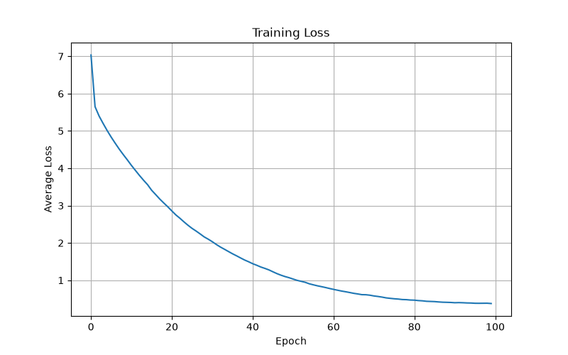

# LSTM Text Generation

This project is a text generation model built in PyTorch using an LSTM neural network and pretrained GloVe word embeddings. It is currently trained on a dataset of jokes, but the project was designed so it can be trained on other text datasets as well.

The project includes the full machine learning pipeline, including text preprocessing, tokenization, vocabulary creation, model training, evaluation, and text generation. During training, the model automatically records training information and generates graphs and sample outputs to help evaluate performance.

## Features
* Built an LSTM language model in PyTorch using pretrained GloVe word embeddings.
* Created a preprocessing pipeline for tokenization, vocabulary creation, and sequence padding.
* Implemented configurable training and testing workflows with automated reporting and loss graphs.
* Generated text from user-provided prompts using probabilistic sampling with temperature scaling.

## Results
Reports with graphs are automatically generated in JokeGenerator/result/joke_generation_saves/outputs. For this specific model the results are as follows:

| Parameter | Value |
|------------|---------|
| Epochs | 100 |
| Learning Rate | 0.005 |
| Batch Size | 100 |
| Hidden Size | 256 |
| Embedding Size | 50 |
| Vocabulary Size | 20,000 |
| Max Sentence Length | 25 |
| Optimizer | Adam |
| Loss Function | CrossEntropyLoss(ignore_index=0) |
| Device | CPU |

- Initial Loss: 7.0326
- Final Loss: 0.3663
- Epochs Trained: 100

| Prompt | Generated Text |
|----------|---------------|
| why did the | why did the man throw his watch out the window ? he wanted to see time fly ! |
| can february march | can february march ? no , but april may |
| veto staircase build | veto staircase build ) do you 10 ? 's ? right cold ! (This is just a test to see how the model handles random inputs)|
